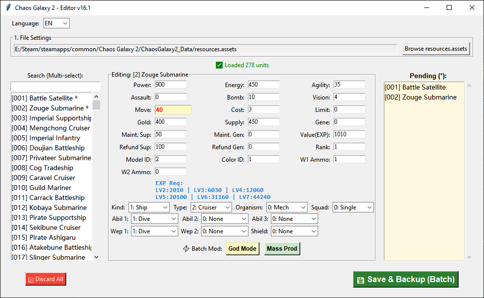

# Chaos Galaxy 2 - Full Attributes Editor (v16.1)

A desktop save/assets editor for *Chaos Galaxy 2* built with Python, Tkinter, and UnityPy. Supports batch modifications, stat copying, and multi-language interfaces (TW/CN/EN).

## Preview


## Features
- **Batch Modification:** Quick "God Mode" and "Mass Production" options for multiple selected units.
- **Data Backup:** Automatically creates timestamped backups before writing changes into `resources.assets`.
- **Multilingual Support:** Dynamic UI switching between Traditional Chinese, Simplified Chinese, and English.

## How to Build (.exe)

If you want to compile the source code into a standalone executable, follow these steps:

1. **Install Dependencies:**
   ```bash
   pip install UnityPy pyinstaller
   ```
2. **Build with Spec File**
   ```bash
   pyinstaller ChaosGalaxy2Patcher.spec
   ```
3. **Output**
   
   The compiled executable ChaosGalaxy2Patcher.exe will be located in the dist/ folder.
